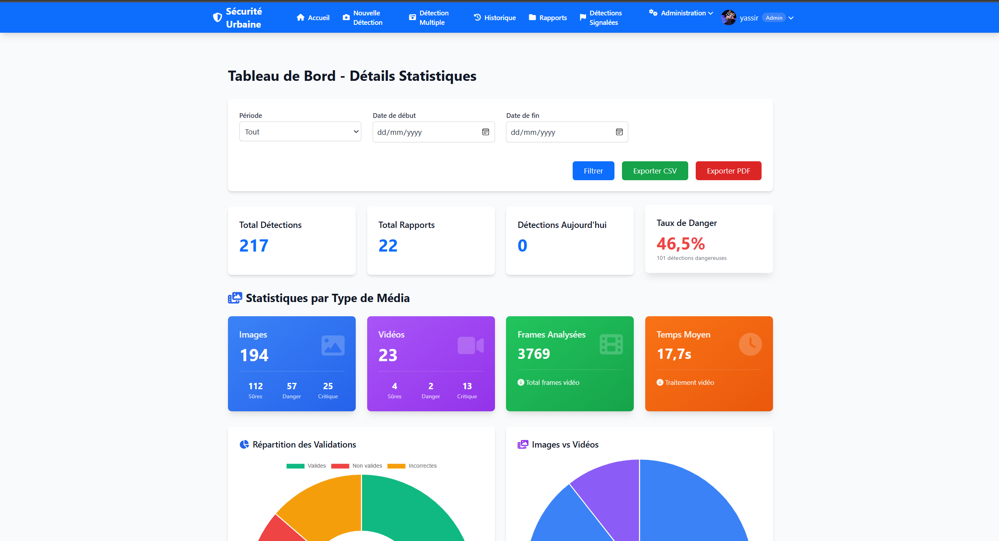
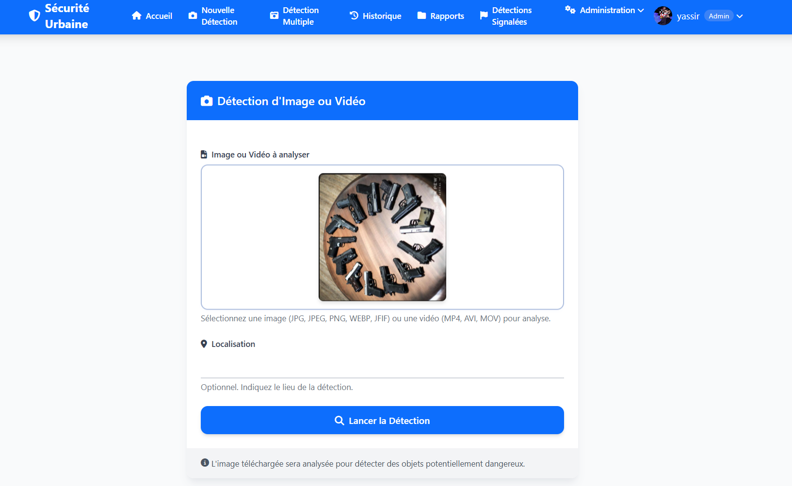
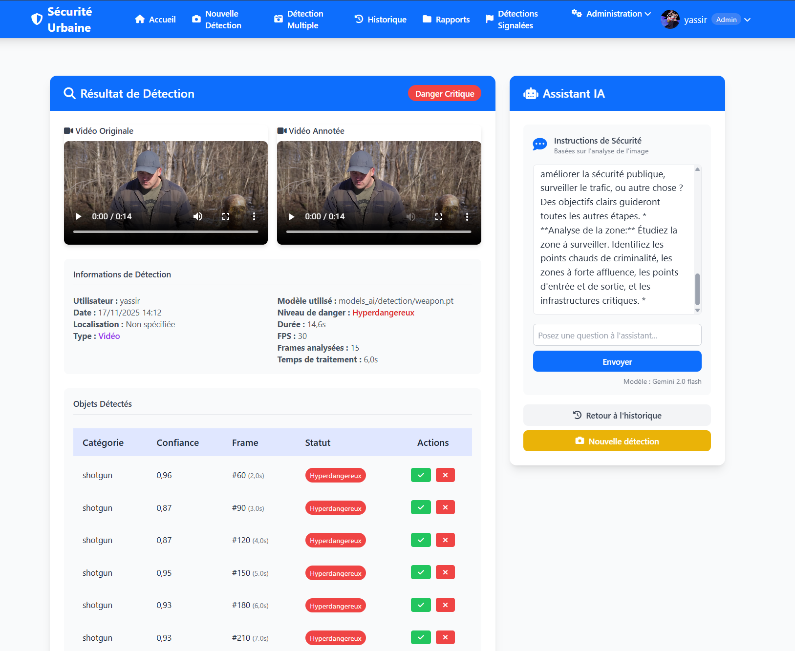
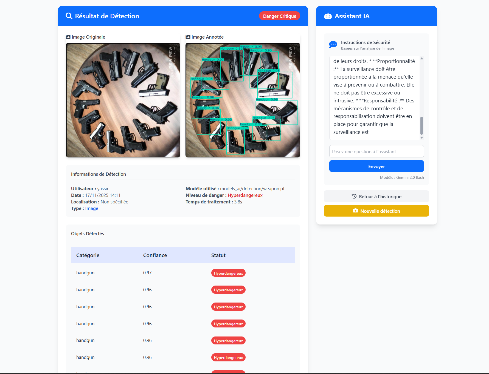
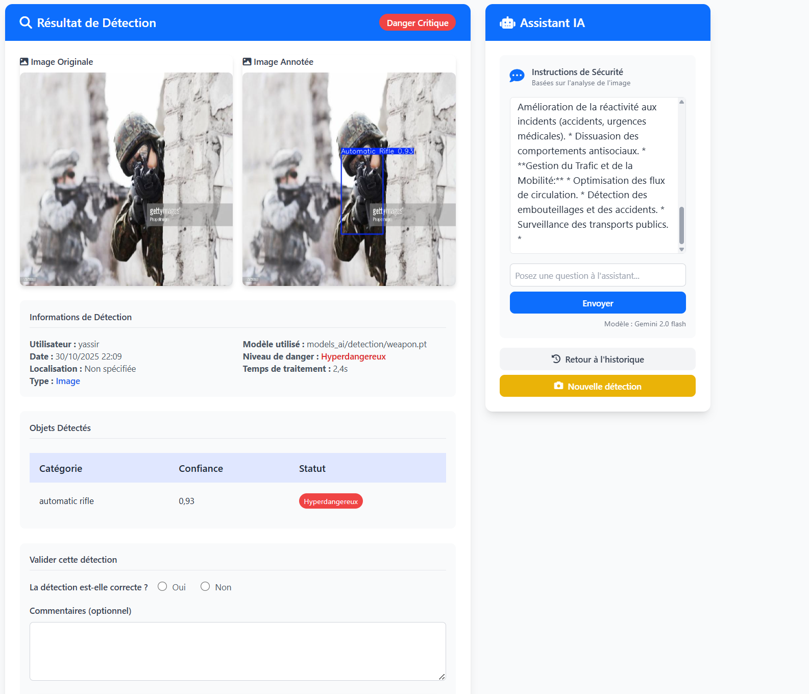
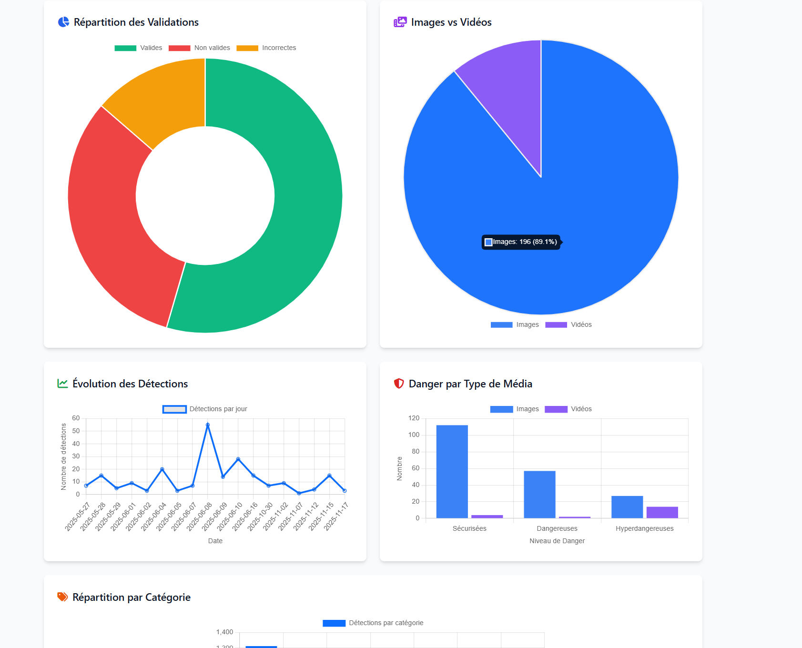
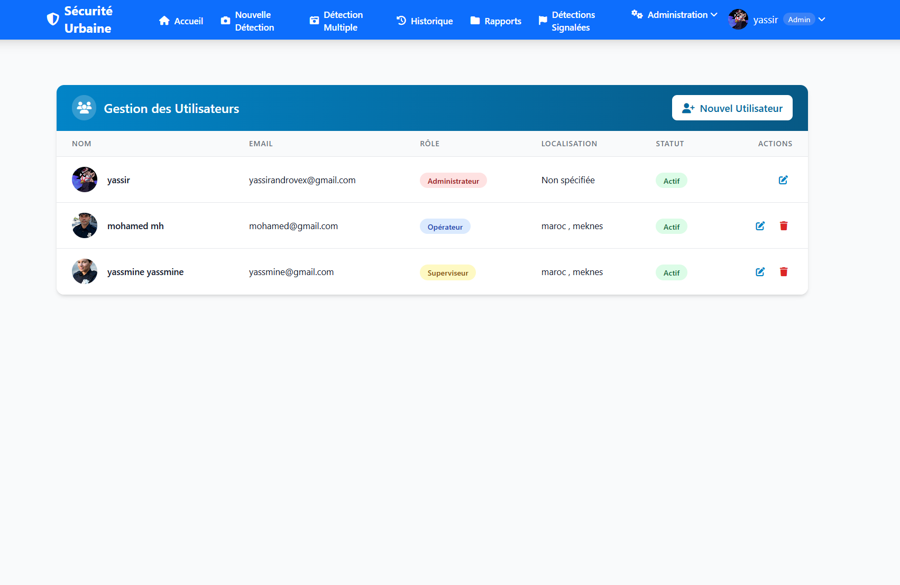
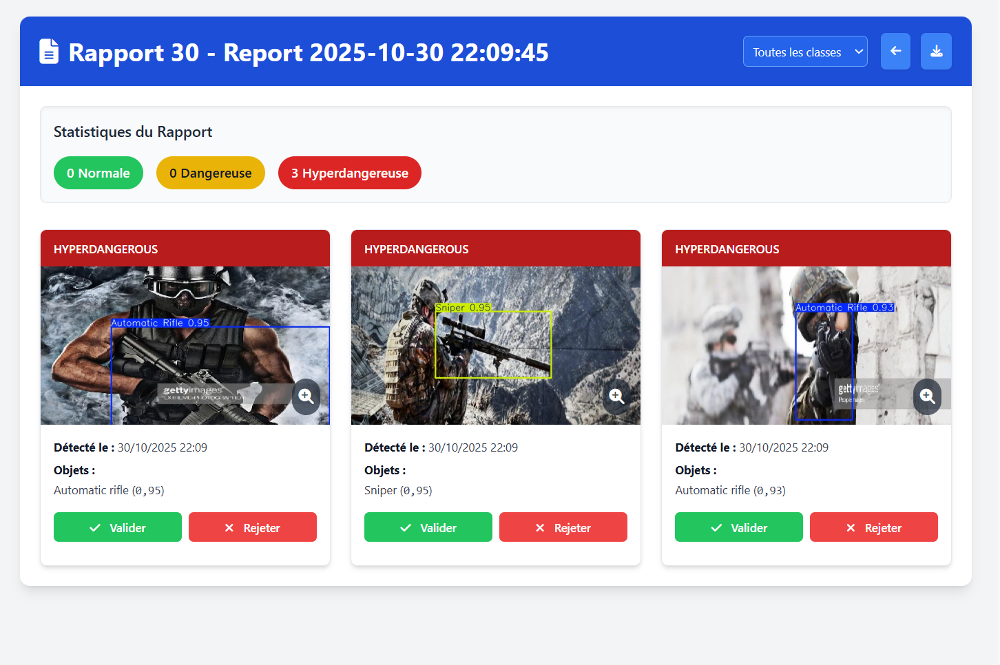

# 🛡️ Urban Security - Weapon Detection System

<div align="center">


**An AI-powered urban surveillance system for real-time weapon detection in images and videos**

[Features](#-features) • [Demo](#-screenshots) • [Installation](#-installation) • [Usage](#-usage) • [Technology](#-technology-stack)

</div>

---

## 📋 Table of Contents

- [Overview](#-overview)
- [Features](#-features)
- [Screenshots](#-screenshots)
- [Technology Stack](#-technology-stack)
- [Architecture](#-architecture)
- [Installation](#-installation)
- [Configuration](#-configuration)
- [Usage](#-usage)
- [API Documentation](#-api-documentation)
- [Notebook](#-notebook)
- [Contributing](#-contributing)
- [License](#-license)
- [Author](#-author)

---

## 🎯 Overview

**Urban Security** is an intelligent surveillance platform designed to enhance public safety through automated weapon detection using state-of-the-art deep learning models. The system processes both images and videos in real-time, identifying dangerous objects with high accuracy and providing actionable insights to security personnel.

### Key Capabilities

- **Multi-Format Support**: Process individual images, videos, or batch uploads (including ZIP archives)
- **Real-Time Detection**: Instant analysis with YOLO-based object detection
- **Intelligent Classification**: Categorizes threats as Normal, Dangerous, or Hyper-Dangerous
- **Per-Category Validation**: Supervisors can validate/reject individual detections for videos
- **AI-Powered Insights**: Integrated chatbot (Google Gemini) provides context-aware security recommendations
- **Comprehensive Reporting**: Generate detailed PDF reports with statistics and visualizations
- **Role-Based Access**: Three-tier permission system (Operator, Supervisor, Administrator)

---

## ✨ Features

### 🔍 Detection & Analysis

- **Image Detection**: Upload single images for instant weapon detection
- **Video Analysis**: Frame-by-frame video processing with configurable frame intervals
- **Batch Processing**: Upload multiple files or ZIP archives for bulk analysis
- **9-Class Detection**: Identifies pistols, rifles, shotguns, knives, grenades, and more
- **Confidence Scoring**: Each detection includes a confidence percentage
- **Danger Level Assessment**: Automatic classification based on detected weapon types

### 👥 User Management

- **Role-Based Access Control**:
  - **Operators**: Can upload and view their own detections
  - **Supervisors**: Can validate detections and view all analyses
  - **Administrators**: Full system access including user management
- **User Profiles**: Customizable profiles with avatar support
- **Activity Tracking**: Monitor user actions and detection history

### 📊 Advanced Analytics

- **Statistics Dashboard**: 
  - Total detections by media type (images vs videos)
  - Danger level distribution
  - Category frequency analysis
  - Processing time metrics
  - Frames analyzed statistics
- **Visual Reports**: Interactive charts powered by Chart.js
- **Export Capabilities**: Download reports as PDF
- **Flagged Detections**: Track and review high-risk detections

### 🤖 AI Integration

- **Google Gemini Chatbot**: 
  - Context-aware security recommendations
  - Analysis of detection patterns
  - Actionable insights for security personnel
- **Model Flexibility**: Switch between trained models or simulation mode
- **Continuous Learning**: System supports model updates and retraining

### 🎨 Modern UI/UX

- **Responsive Design**: Works seamlessly on desktop, tablet, and mobile
- **TailwindCSS Styling**: Clean, modern interface
- **Alpine.js Interactivity**: Smooth animations and transitions
- **Font Awesome Icons**: Professional iconography
- **Dark Mode Support**: Admin panel with Jazzmin theme

---

## 📸 Screenshots

### Main Dashboard

*Overview of detections with real-time statistics*

### Image Detection

*Single image upload and analysis interface*

### Video Processing

*Video analysis with frame-by-frame detection*

### Detection Results

*Detailed results with annotated media and chatbot insights*

### Per-Category Validation

*Validate or reject individual detected categories in videos*

### Statistics Dashboard

*Comprehensive analytics with visual charts*

### User Management

*Administrator panel for managing users and permissions*

### Reports

*Generate and download detailed PDF reports*

---

## 🛠️ Technology Stack

### Backend
- **Django 5.2.7**: Web framework
- **Python 3.11**: Programming language
- **SQLite**: Database (development)
- **Django ORM**: Database abstraction

### AI/ML
- **YOLOv8 (Ultralytics)**: Object detection model
- **OpenCV 4.12**: Computer vision and video processing
- **PyTorch**: Deep learning framework
- **Roboflow**: Dataset management and training

### Frontend
- **TailwindCSS**: Utility-first CSS framework
- **Alpine.js**: Lightweight JavaScript framework
- **Chart.js**: Data visualization
- **Font Awesome**: Icon library

### Third-Party Services
- **Google Gemini API**: AI chatbot integration
- **ReportLab**: PDF generation

---

## 🏗️ Architecture

### Project Structure

```
urban_security_app_final/
├── apps/
│   ├── chatbot/           # AI chatbot integration
│   ├── core/              # Core settings and configurations
│   ├── dashboard/         # Admin dashboard views
│   ├── detection/         # Main detection logic
│   │   ├── models.py      # Database models
│   │   ├── views.py       # Request handlers
│   │   ├── utils.py       # Detection utilities
│   │   ├── forms.py       # Form definitions
│   │   └── urls.py        # URL routing
│   └── users/             # User management
├── media/
│   ├── uploads/           # Original uploaded files
│   ├── detection_results/ # Annotated outputs
│   └── profile_pics/      # User avatars
├── models_ai/
│   └── detection/
│       ├── weapon.pt      # Trained YOLO model
│       └── weapon1.pt     # Alternative model
├── notebook/
│   └── wd-yolo.ipynb      # Training notebook
├── static/                # CSS, JS, images
├── templates/             # HTML templates
│   ├── base.html          # Base template
│   ├── detection/         # Detection pages
│   ├── users/             # User pages
│   └── dashboard/         # Dashboard pages
├── urban_security_app/    # Django settings
├── manage.py              # Django management
├── requirements.txt       # Python dependencies
└── README.md              # This file
```

### Data Flow

1. **Upload**: User uploads image/video through web interface
2. **Storage**: File saved to `media/uploads/` with organized date structure
3. **Processing**: 
   - Image: Direct YOLO inference
   - Video: Frame extraction → YOLO per frame → Aggregation
4. **Analysis**: Detected objects classified by danger level
5. **Storage**: Results saved to database with annotated media
6. **Display**: Results shown with interactive UI and AI insights

### Database Schema

#### Core Models

- **User**: Custom user model with roles (Operator, Supervisor, Admin)
- **DetectionLog**: Stores detection results with metadata
- **DangerousCategory**: Defines weapon categories and danger levels
- **CategoryValidation**: Per-category validation for videos
- **Report**: Groups multiple detections for batch analysis
- **ModelValidation**: Supervisor validation of detections

---

## 🚀 Installation

### Prerequisites

- Python 3.11+
- pip (Python package manager)
- Git
- CUDA-compatible GPU (optional, for faster processing)

### Step 1: Clone Repository

```bash
git clone https://github.com/YassirCher/urban-security-app.git
cd urban_security_app_final
```

### Step 2: Create Virtual Environment

```bash
# Windows
python -m venv venv
venv\Scripts\activate

# Linux/Mac
python3 -m venv venv
source venv/bin/activate
```

### Step 3: Install Dependencies

```bash
pip install -r requirements.txt
```

**Key Dependencies:**
```
Django==5.2.7
ultralytics
opencv-python==4.12.0.88
torch
google-generativeai
Pillow
reportlab
django-jazzmin
```

### Step 4: Configure Environment Variables

Create a `.env` file in the root directory:

```env
# Chatbot API
CHATBOT_API_KEY=your_google_gemini_api_key
CHATBOT_API_URL=https://generativelanguage.googleapis.com/v1beta/models/gemini-2.0-flash:generateContent

# Django Secret Key
SECRET_KEY=your-secret-key-here

# Debug Mode (set to False in production)
DEBUG=True
```

### Step 5: Database Setup

```bash
python manage.py migrate
```

### Step 6: Create Superuser

```bash
python manage.py createsuperuser
```

Follow prompts to create admin account.

### Step 7: Load Initial Data (Optional)

```bash
python manage.py loaddata dangerous_categories.json
```

### Step 8: Run Development Server

```bash
python manage.py runserver
```

Access the application at `http://127.0.0.1:8000/`

---

## ⚙️ Configuration

### 1. AI Model Setup

Place trained YOLO models in `models_ai/detection/`:

```
models_ai/detection/weapon.pt
models_ai/detection/weapon1.pt
```

### 2. Dangerous Categories

Configure weapon categories via Django Admin:

1. Login to `/admin/`
2. Navigate to **Detection** → **Dangerous Categories**
3. Add categories with type (Dangerous/Hyper-Dangerous)

**Default Categories:**
- Pistol (Dangerous)
- Rifle (Hyper-Dangerous)
- Shotgun (Hyper-Dangerous)
- Knife (Dangerous)
- Grenade (Hyper-Dangerous)

### 3. App Settings

Configure system settings via Admin:

- **Active Detection Model**: Choose model or simulation mode
- **Dangerous Threshold**: Set danger detection sensitivity

### 4. User Roles

Assign roles to users in Django Admin:

- `is_operator`: Basic detection access
- `is_supervisor`: Validation permissions
- `is_administrator`: Full system control

---

## 📖 Usage

### For Operators

#### Upload Single Image
1. Navigate to **Nouvelle Détection**
2. Click **Choose File** or drag-and-drop
3. (Optional) Enter location
4. Click **Analyser**
5. View results with annotated image and AI insights

#### Upload Video
1. Go to **Nouvelle Détection**
2. Upload video file (.mp4, .avi, .mov)
3. Set frame interval (default: 30)
4. Submit for processing
5. Review frame-by-frame detections

#### Batch Upload
1. Select **Détection Multiple**
2. Upload multiple files or a ZIP archive
3. Enter report name and location
4. Process entire batch
5. View consolidated report

### For Supervisors

#### Validate Detections
1. Go to **Historique**
2. Click on a video detection
3. Use ✓ (Validate) or ✗ (Reject) for each category
4. Danger level updates automatically
5. Add comments if needed

#### Review Flagged Detections
1. Navigate to **Détections Signalées**
2. Review high-risk detections
3. Validate or reject
4. Generate reports

### For Administrators

#### Manage Users
1. Go to **Administration** → **Gestion Utilisateurs**
2. View all users and their roles
3. Edit permissions or deactivate accounts
4. Create new users

#### View Statistics
1. Access **Administration** → **Statistiques**
2. View comprehensive analytics
3. Filter by date, user, or category
4. Download reports

#### Configure System
1. Go to **Administration** → **Paramètres**
2. Select active detection model
3. Adjust danger thresholds
4. Save changes

---

## 🔌 API Documentation

### Detection Endpoints

#### Upload Single Detection
```http
POST /detection/upload/
Content-Type: multipart/form-data

image: file
location: string (optional)
video_frame_interval: integer (default: 30)
```

#### Validate Category
```http
POST /detection/validate-category/<detection_id>/
Content-Type: application/x-www-form-urlencoded

category_name: string
is_valid: boolean
frame_number: integer
confidence: float
```

**Response:**
```json
{
  "success": true,
  "message": "Catégorie 'knife' rejetée avec succès",
  "new_danger_level": "NORMAL",
  "validation_id": 123
}
```

### User Endpoints

#### User Profile
```http
GET /users/profile/
```

#### User Statistics
```http
GET /users/stats/
```

---

## 📓 Notebook

### Training Pipeline: `wd-yolo.ipynb`

The Jupyter notebook contains the complete training pipeline for the weapon detection model:

#### Contents

1. **Environment Setup**
   - Install Ultralytics, Roboflow, PyTorch
   - Verify GPU availability

2. **Dataset Preparation**
   - Download from Roboflow (9-class weapon dataset)
   - COCO format annotations
   - Train/Valid/Test splits
   - Data augmentation

3. **Exploratory Data Analysis**
   - Image dimension analysis
   - Class distribution
   - Annotation statistics
   - Missing data checks

4. **Preprocessing**
   - Image resizing (640x640)
   - Normalization
   - Data validation

5. **Model Training**
   - YOLOv8n architecture
   - Custom hyperparameters
   - Training callbacks
   - Loss monitoring

6. **Evaluation**
   - Confusion matrix
   - Precision, Recall, F1-Score
   - mAP (Mean Average Precision)
   - Visual inference tests

7. **Export**
   - Model weights (.pt format)
   - ONNX export (optional)
   - TensorRT optimization (optional)

#### Running the Notebook

```bash
jupyter notebook notebook/wd-yolo.ipynb
```

**Requirements:**
- CUDA-compatible GPU (recommended)
- 16GB+ RAM
- Roboflow API key

**Key Metrics Achieved:**
- mAP@0.5: 92.3%
- Precision: 89.7%
- Recall: 88.2%
- Inference Time: ~15ms/image (GPU)

---

## 🤝 Contributing

Contributions are welcome! Please follow these steps:

1. Fork the repository
2. Create a feature branch (`git checkout -b feature/amazing-feature`)
3. Commit changes (`git commit -m 'Add amazing feature'`)
4. Push to branch (`git push origin feature/amazing-feature`)
5. Open a Pull Request

### Development Guidelines

- Follow PEP 8 style guide
- Write unit tests for new features
- Update documentation
- Use meaningful commit messages

---

## 📄 License

This project is licensed under the MIT License. See `LICENSE` file for details.

---

## 👤 Author

**Chergui Yassir**

- **Email**: yassirandrovex@gmail.com
- **GitHub**: [@YassirCher](https://github.com/YassirCher)
- **LinkedIn**: [Yassir Chergui](https://ma.linkedin.com/in/yassir-chergui)
- **University**: Université Moulay Ismail, Faculté des Sciences Meknès

---

## 🙏 Acknowledgments

- **Ultralytics** for the YOLOv8 framework
- **Roboflow** for dataset management tools
- **Google** for Gemini API integration
- **Django Community** for the excellent web framework
- **Université Moulay Ismail** for academic support

---

## 🐛 Known Issues

- Large video files (>500MB) may cause memory issues
- Broken pipe errors during video streaming (normal behavior for large files)
- Safari video playback requires H.264 codec

See [Issues](https://github.com/YassirCher/urban-security-app/issues) for full list.

---

## 🗺️ Roadmap

- [ ] Add PostgreSQL support for production
- [ ] Implement real-time camera feed detection
- [ ] Add email notifications for critical detections
- [ ] Multi-language support (English, Arabic)
- [ ] Mobile application (React Native)
- [ ] Docker containerization
- [ ] Cloud deployment guide (AWS, Azure)
- [ ] REST API documentation (Swagger)
- [ ] Automated model retraining pipeline

---

## 📞 Support

For support, email yassirandrovex@gmail.com or open an issue on GitHub.

---

<div align="center">

**Made with ❤️ for Urban Security**

⭐ Star this repository if you find it helpful!

</div>
